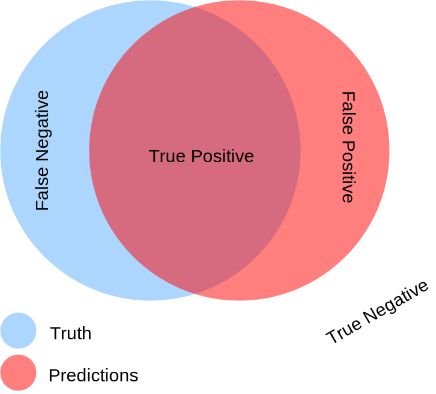
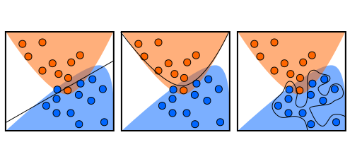
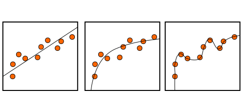

# Decision Tree Learning

## Main

- [Training the decision tree and random forest classifier](src/ML_Intro.ipynb)
- [Plugging the classifier into an iOS app](src/DecisionTreeDemo/)

## Supplementary

- [Dataset of extraterrestrial life forms](src/extraterrestrials.csv)
- [Generating synthetic dataset in python](src/supplementary/data_generation.ipynb)
- [Building confusion matrix](src/supplementary/confusion_matrix.ipynb)

## Illustrations

Dataset explanation

Two types of errors

Classification task

Regression task

How decision tree works
