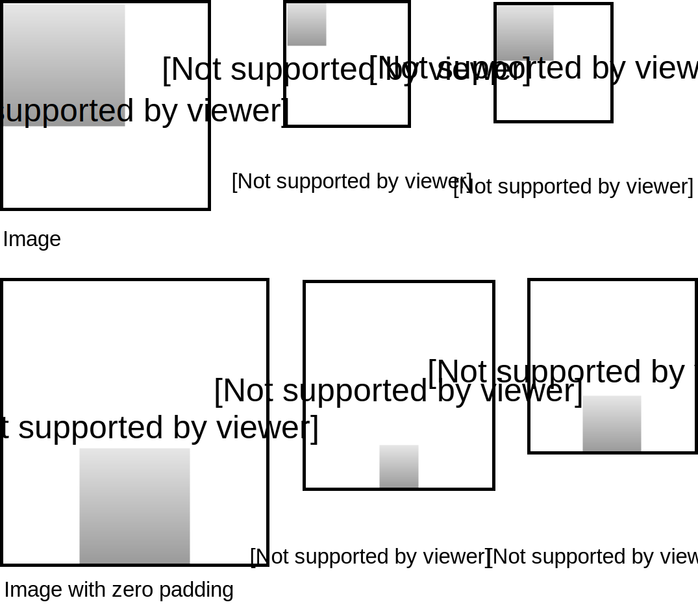
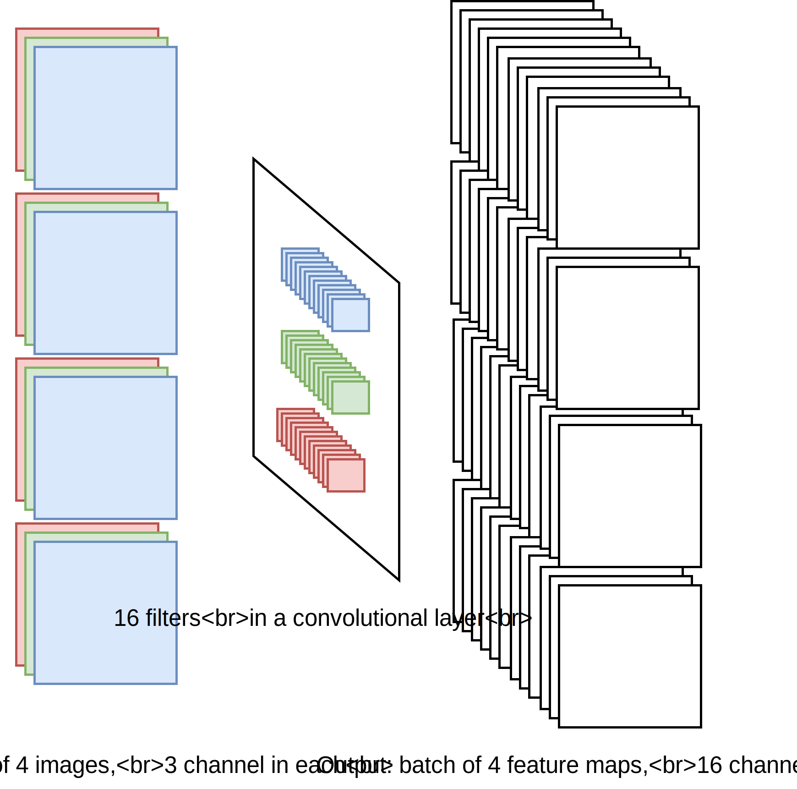

# Convolutional Neural Networks and Computer Vision

## Main

- [Training a convolutional neural network for emotions recognition](src/emo_cnn.ipynb)
- [Swift playground explaining convolutions](src/Convolution_filters.playground)
- [iOS app which recognizes emotions on the face](src/empathy_iOS_app/)

## Illustrations

Some computer vision tasks: classification, localization, object detection, pose estimation, semantic segmentation, instance segmentation.

### CNN building blocks

Pooling operation

Convolution operation

Examples of convolutional filters

Batch convolution

Fully connected layer

VGG-16 neural network for image classification
